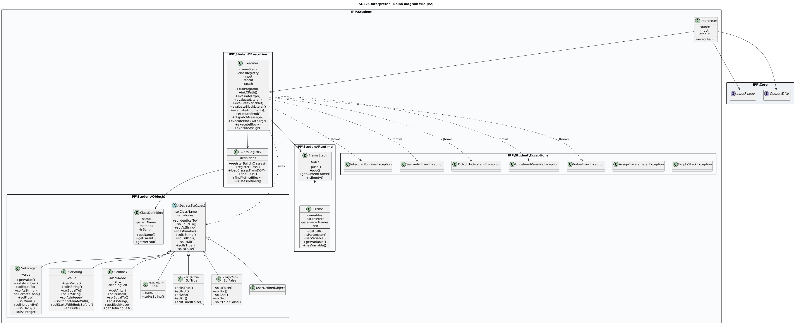

# PARSER
## Přehled
Skript `parse.py` analyzuje zdrojový kód jazyka SOL25. Provádí lexikální, syntaktickou a sémantickou analýzu a generuje XML reprezentaci abstraktního syntaktického stromu (AST).

## Struktura řešení

### 1. Lexikální analýza
- **Lexer:** Rozděluje vstupní kód do tokenů pomocí regulárních výrazů.
- Rozpoznává:
  - **Bílá místa a komentáře** (nezanořené, uzavřené v uvozovkách)
  - **Řetězcové literály** s escapováním speciálních znaků
  - **Čísla, identifikátory** a symboly (např. `:=`, `:`, `[`, `]`, `{`, `}`, `(`, `)`, `.`)

### 2. Syntaktická analýza
- **Parser:** Implementován metodou rekurzivního sestupu.
- **AST:** Vytváří instance tříd (Program, ClassDef, Method, Block, Parameter, Assignment, Var, Literal, Send) podle definované gramatiky.
- Ověřuje správný formát identifikátorů (např. třídy – první písmeno velké, metody – první písmeno malé) a správné pořadí tokenů.

### 3. Sémantická analýza
- **SemanticAnalyzer:** Kontroluje:
  - Duplicitní definice tříd a metod
  - Přítomnost třídy `Main` s metodou `run` bez parametrů
  - Správnou dědičnost (včetně kontroly cyklických odkazů)
  - Správné používání proměnných a rezervovaných identifikátorů
  - Metoda `lookup_method` rekurzivně vyhledává metody v uživatelských i vestavěných třídách.

### 4. Generování XML
  - **XML generátor:** Převádí AST do XML struktury:
  - Kořenový element `<program>` má atribut `language="SOL25"` a případně `description`
  - Třídy jsou reprezentovány elementy `<class>` s atributy `name` a `parent`
  - Metody a bloky jsou mapovány na elementy s podřízenými elementy pro parametry a přiřazení
  - Literály jsou speciálně ošetřeny (escapování apostrofů a speciálních znaků)

### 5. Řízení chyb
- Definované chybové kódy pokrývají lexikální, syntaktické, sémantické i interní chyby.
- Funkce `error_exit` vypisuje chybové zprávy a ukončuje program s příslušným kódem.

## Implementační detaily
- **Modulární design:** Oddělení lexikální, syntaktické a sémantické analýzy spolu s generováním XML usnadňuje údržbu.
- **Validace vstupu:** Přísné kontroly formátu identifikátorů a pořadí tokenů zajišťují robustní analýzu.
- **Rekurzivní zpracování:** Umožňuje efektivní analýzu zanořených výrazů a bloků.

# INTERPRETER
# Celková filozofie návrhu

Cílem bylo realizovat interpret jazyka **SOL25** v prostředí PHP 8.4 nad povinným rámcem `ipp‑core`. Pro dosažení čistého a rozšiřitelného řešení jsem zvolil **čistě objektový** přístup. Každý prvek jazyka (literál, blok, uživatelský objekt, …) je reprezentován instancí třídy odvozené z `Objects\AbstractSolObject`.  Interpret tak zůstává striktně datově řízen: vykonávání programu je „jen“ zřetězená interpretace uzlů AST (XML) a zasílání zpráv mezi objekty.

Klíčové principy návrhu:

* **Jednotný objektový model** – interní objekty SOL25 žijí výhradně jako PHP objekty; dědičnost SOL25 se mapuje na dědičnost PHP.
* **Dispečerské jádro** – třída `Execution\Executor` implementuje centrální metodu `dispatchMessage()` (pattern *Message Dispatcher*).  Ta rozhoduje, jak naložit se zprávou: vestavěná metoda, uživatelská metoda, blok nebo přístup k atributu.
* **Oddělení zodpovědností (SRP)** – `ClassRegistry` pouze drží metadata tříd, `FrameStack` spravuje volací zásobník, `Executor` řeší sémantiku, I/O zajišťují rozhraní z rámce.

---

# Architektura a interní reprezentace

| Vrstva | Popis |
| ------ | ----- |
| **XML AST** | DOM `DOMDocument` zachovává strom tak, jak jej dodal `parse.py`.  Navigace probíhá přes `DOMXPath`; změny struktury se **nikde** nedělají. |
| **ClassRegistry / ClassDefinition** | Registruje vestavěné (`Object`, `Integer`, …) i uživatelské definice načtené z XML; metadata udržuje v objektech `Objects\ClassDefinition` a zajišťuje vyhledání metod (`findMethodBlock`). |
| **Runtime** | `Runtime\Frame` drží lokální proměnné + odkaz `self`; `FrameStack` realizuje LIFO. |
| **Objects** | Každá hodnota SOL25 je podtřídou `AbstractSolObject`.  *Jedináčci* `SolNil`, `SolTrue`, `SolFalse` používají **Singleton**.  Vestavěné aritmetické operace jsou metodami `solPlus`, `solMinus`, atd. |
| **Executor** | Rekurzivně vyhodnocuje `<expr>`, řídí pořadí instrukcí podle `order`, provádí bloky a řeší chyby (mapa kódů 51–53). |

---

# Vnitřní tok v `Execution\Executor`

1. `runProgram()` najde `Main.run` a připraví první `Frame`.
2. `executeBlock()` seřadí `<assign>` podle `order` a volá `executeAssign()`.
3. `evaluateExpr()` rekurzivně určí druh výrazu (literal/var/block/send).
4. `executeSend()` sestaví příjemce + argumenty a předá je do `dispatchMessage()`.
5. `dispatchMessage()` 
   - (a) rozliší třídní/instanční zprávu,  
   - (b) hledá metodu v hierarchii,  
   - (c) padá na chybu 51, pokud nic neodpovídá.
6. `executeBlockWithArgs()` vytvoří nový `Frame`, provede blok a vrátí výsledek posledního výrazu.

---

# Klíčové aspekty OO návrhu

* **Singleton** – zaručuje, že `nil`, `true`, `false` představují vždy tutéž instanci (identita ⇔ **identicalTo:**).
* **Factory Method** – konstruktor `ClassRegistry::instantiate()` vytváří instanci správného PHP typu podle názvu SOL25 třídy.
* **Template Method** – `Executor::executeBlockWithArgs()` fixuje rámec volání a deleguje vlastní kód na `executeBlock()`.

Tímto způsobem lze přidat nový vestavěný typ bez zásahu do `Executor`: stačí PHP třída `SolDecimal` a registrace v `ClassRegistry`.

---

# Rozšiřitelnost a údržba

* **Nová vestavěná operace** – přidat metodu `solXxx` do příslušné třídy, mapování v `selectorToPhpMethod()` je generické.
* **Nový AST konstrukt** – vytvořit privátní `evaluateXxx()` a zaregistrovat ho ve switchi `evaluateExpr()`.
* **Statická analýza** – projekt prochází **PHPStan level max** bez chyb; kód odpovídá **PSR‑1/4/12** (ověřeno `phpcs`).

---

# UML diagram

